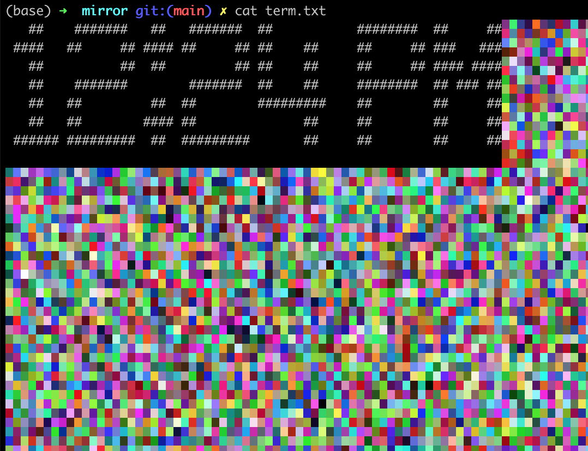
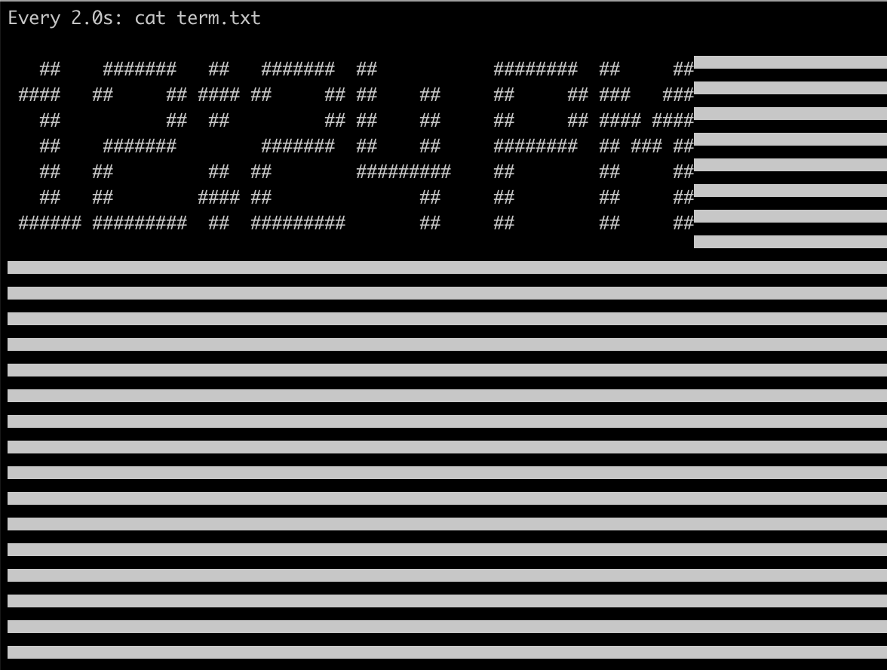

# magic-mirror-zero
The purpose of this project is to create some lightweight code that will duplicate some of the functionality of existing magic mirror software, but without as much overhead.
The [most popular magic mirror software](https://github.com/MichMich/MagicMirror) requires a raspberry pi 3 running the full desktop version of Raspberry Pi OS, as well as Electron. That seems like overkill for a project that's displaying a small amount of information on a screen.
This version will:
- run on a Raspberry Pi Zero
- require only Raspberry Pi OS lite

As a trade off, this will have a largely text based display paradigm, with only crude graphics available.
## Requirements
- figlet

## Organization
The central idea of this approach is as follows:
- The Raspberry Pi Zero running the lite version of the OS provides a terminal window
- We can grab the width and height of the terminal window (in columns and lines) using os.get_terminal_size()
- We can then embed all the information we're interested in dispalying into a block of text term_width x term_height characters in size. This block of text will be stored as a text file called term.txt.
- Each plugin we enable will be run as a cron job run on a specified schedule. These will update the relevant section of text in term.txt.
    - For example: we've made a plugin that retrieves the weather and displays the forecast. We've specified that this forecast is to be displayed in the upper left corner of our magic mirror (let's say the first 40 columns and the first 3 rows). When the cron job is executed we would retrieve the forecast, convert it to a block of text no larger than 40x3 characters, and insert it into term.txt

## color-watch
I spent a long time trying to figure out how to display 
I was going insane trying to work this out. Basically, if you try to use the 'watch' command, it won't work with ANSI escape sequences.
There's a '--color' flag, but it doesn't [support 8-bit colors and above.](https://gitlab.com/procps-ng/procps/-/issues/44) The watch command worked _perfectly_ when there was just ordinary text, but when I tried to use it to watch a test file full of colored squares I ended up getting a bunch of white horizontal stripes across my screen:
<table><tr>
<td>  </td>
<td>  </td>
</tr>
<tr>
<td>output of `cat term.txt`</td>
<td>the watch command butchering my file</td>
</tr></table>
It was gross.

I also tried using `tail -n +0 -f cat term.txt`. That kinda worked (with some tweaks to the code, so the very last bit of the 
file got changed every time its contents changed), but only on my laptop where I was doing testing. The Raspberry Pi Zero doesn't have enough juice to replace the screen very quickly, so whenever the file was updated there was a very noticeable transition as the contents of the file scolled up to replace the old output. 

To make a long story short, after a trek through the wastes of the internet I found this answer: https://stackoverflow.com/a/69388883/19669305

This code is included in the color-watch.sh file. It lets us update the terminal whenever we change the term.txt file while avoiding any obnoxious flickering as the screen is refreshed. This works extremely well even when the screen is full of randomly colored half-blocks with randomly colored backgrounds (you can fill term.txt with this using the term_test.py script in the tests directory). [Stackoverflow user TK009,](https://stackoverflow.com/users/3276936/tk009) I salute you. 

